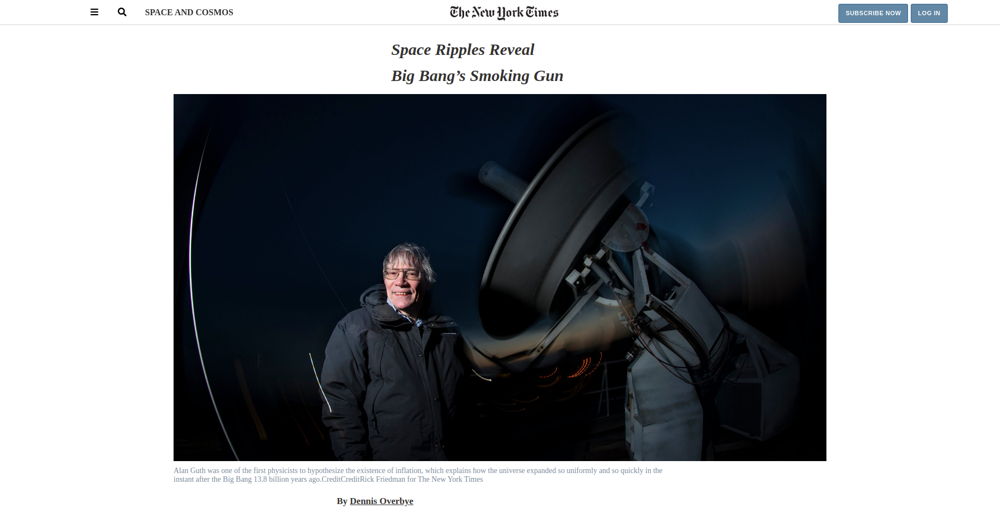

# New York Times
This is our third project. It's about building a replica of a New York Times page with an article, a section with related articles and a footer.

# Contributors
Mouhamadou Diouf (<a href="https://github.com/MouhaDiouf">@mouhadiouf</a>) 
Emmanuel Kamala (<a href="https://github.com/emmanuelkamala">@emmanuelkamala</a>)
# Live Version
<a href="https://raw.githack.com/MouhaDiouf/New_york_times/master/index.html" target="_blank"> Live version</a> 
